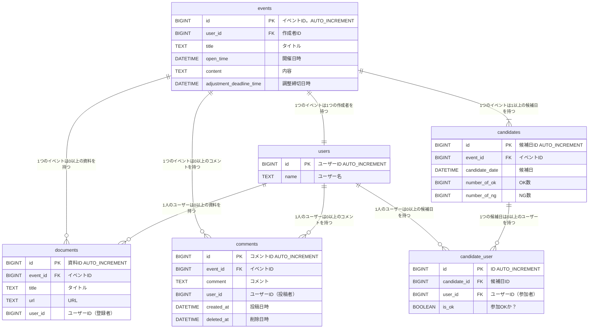

```mermaid
%%{init:{'theme':'default'}}%%
erDiagram

events ||--o{ documents: "1つのイベントは0以上の資料を持つ"
events ||--o{ comments: "1つのイベントは0以上のコメントを持つ"
events ||--|{ candidates: "1つのイベントは1以上の候補日を持つ"
events ||--|| users: "1つのイベントは1つの作成者を持つ"
events {
  BIGINT id PK "イベントID。AUTO_INCREMENT" 
  BIGINT user_id FK "作成者ID"
  TEXT title  "タイトル"
  DATETIME open_time  "開催日時"
  TEXT content  "内容"
  DATETIME adjustment_deadline_time  "調整締切日時"
}

users ||--o{ documents: "1人のユーザーは0以上の資料を持つ"
users ||--o{ comments: "1人のユーザーは0以上のコメントを持つ"
users {
  BIGINT id PK "ユーザーID AUTO_INCREMENT"
  TEXT name "ユーザー名"
}

users ||--o{ candidate_user: "1人のユーザーは0以上の候補日を持つ"
candidates ||--o{ candidate_user: "1つの候補日は0以上のユーザーを持つ"
candidate_user {
  BIGINT id PK "ID AUTO_INCREMENT"
  BIGINT candidate_id FK "候補日ID"
  BIGINT user_id FK "ユーザーID（参加者）"
  BOOLEAN is_ok "参加OKか？"
}

candidates {
  BIGINT id PK "候補日ID AUTO_INCREMENT"
  BIGINT event_id FK "イベントID"
  DATETIME candidate_date "候補日"
  BIGINT number_of_ok "OK数"
  BIGINT number_of_ng "NG数"
}

documents {
  BIGINT id PK "資料ID AUTO_INCREMENT"
  BIGINT event_id FK "イベントID"
  TEXT title "タイトル"
  TEXT url "URL"
  BIGINT user_id "ユーザーID（登録者）"
}

comments {
  BIGINT id PK "コメントID AUTO_INCREMENT"
  BIGINT event_id FK "イベントID"
  TEXT comment "コメント"
  BIGINT user_id "ユーザーID（投稿者）"
  DATETIME created_at "投稿日時"
  DATETIME deleted_at "削除日時"
}
```
